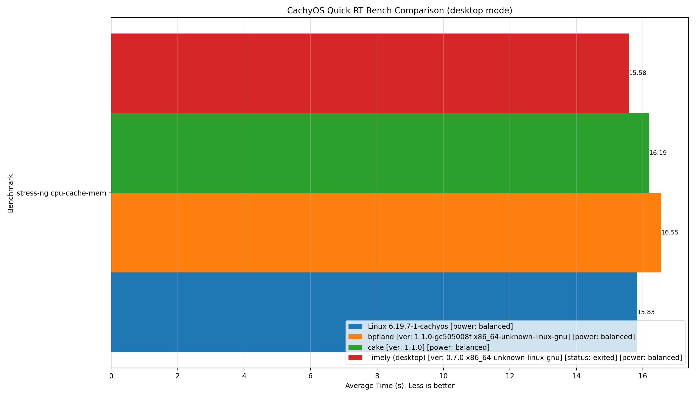
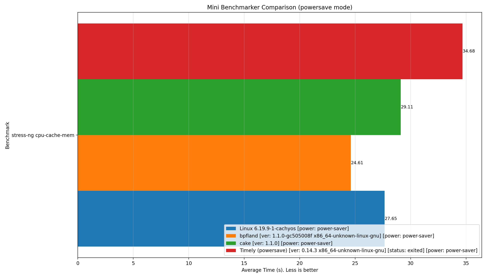
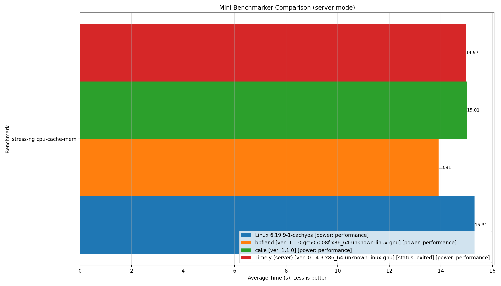

# scx_timely benchmark-artifacts

This branch only stores benchmark artifacts that were linked from public issue discussions or kept as mode snapshots.

It is intentionally kept separate from the source branch so artifact links stay stable without duplicating the full repository contents.

## Latest Mode Snapshots

### Desktop

Latest desktop snapshot kept here: [cachyos-quick-benchmarker-20260322-192352](artifacts/cachyos-quick-benchmarker-20260322-192352)

This quick desktop snapshot was kept as the latest desktop-facing benchmark reference. It shows baseline, `bpfland`, and `cake` finishing clean for the capped scope, while `scx_timely` still hit the broader sched_ext exit case. The main takeaway here is the desktop controller snapshot and its metrics, not a claim that the watchdog issue is solved locally.

- [PNG](artifacts/cachyos-quick-benchmarker-20260322-192352/mini_benchmarker_comparison.png)
- [CSV](artifacts/cachyos-quick-benchmarker-20260322-192352/mini_benchmarker_summary.csv)

### Powersave

Latest powersave snapshot kept here: [mini-benchmarker-20260323-061656](artifacts/mini-benchmarker-20260323-061656)

This was the first powersave run we considered sane enough to keep. It is still experimental and still exits under the shared watchdog class, but the controller behavior was much calmer than the earlier powersave iterations and good enough to stop thrashing the defaults.

- [PNG](artifacts/mini-benchmarker-20260323-061656/mini_benchmarker_comparison.png)
- [CSV](artifacts/mini-benchmarker-20260323-061656/mini_benchmarker_summary.csv)

### Server

Latest server snapshot kept here: [mini-benchmarker-20260323-065408](artifacts/mini-benchmarker-20260323-065408)

This server snapshot was the second confirmation run and stayed in the same healthy range as the first one. Relative to the earlier tuning work, server needed much less churn, so this is the clearest “good enough for now” mode snapshot of the three.

- [PNG](artifacts/mini-benchmarker-20260323-065408/mini_benchmarker_comparison.png)
- [CSV](artifacts/mini-benchmarker-20260323-065408/mini_benchmarker_summary.csv)

